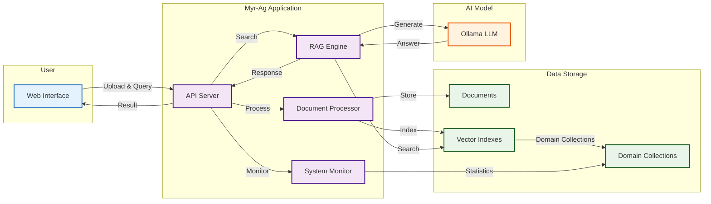
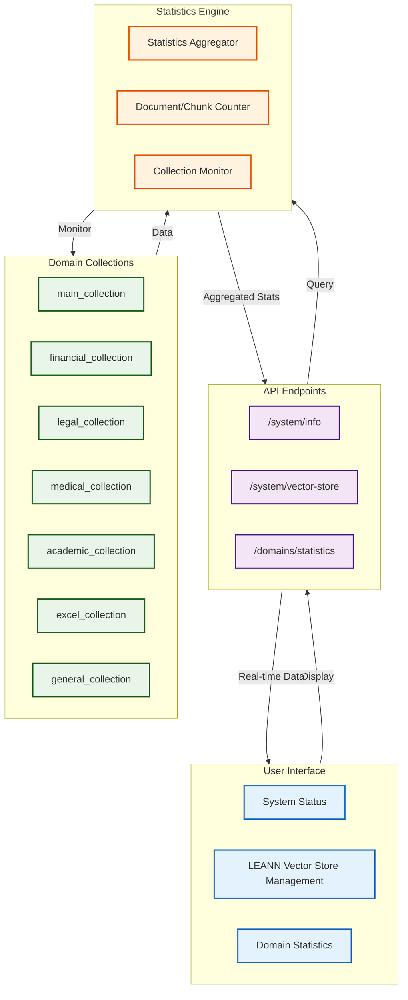
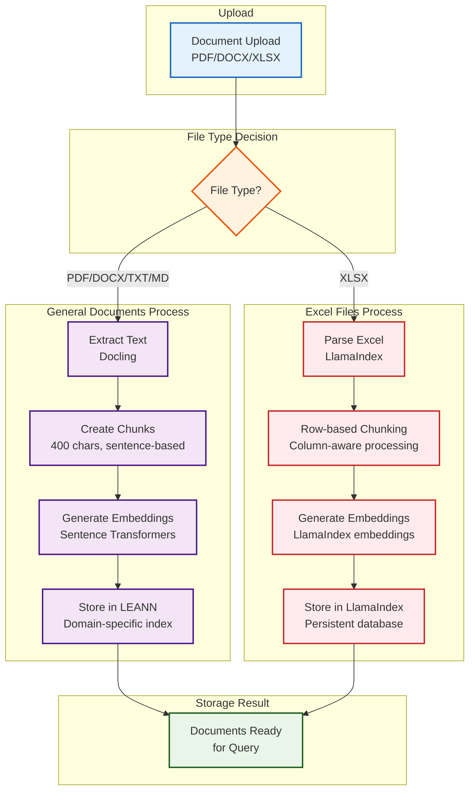
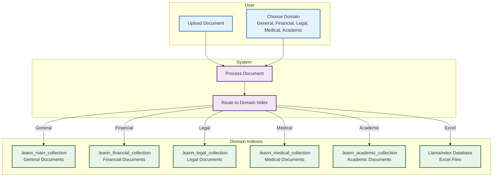
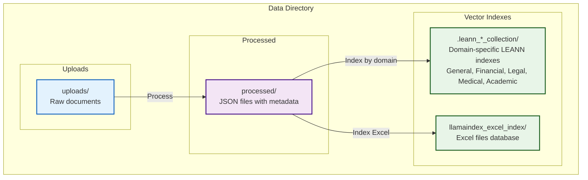

# Myr-Ag Architecture & Processing Diagrams

## System Overview



## System Monitoring Architecture



## Document Processing Flow



## Domain Management



## Data Storage Structure



## Key Technical Specifications

### Document Processing

- **Dual Processing Architecture**: LEANN for general documents, LlamaIndex for Excel files (⚠️ EXPERIMENTAL)
- **Chunk Size**: 400 characters (general), row-based (Excel)
- **Chunk Overlap**: 100 characters (general), column-aware (Excel)
- **Supported Formats**: PDF, DOCX, XLSX, PPTX, TXT, MD, HTML, XHTML, CSV, PNG, JPEG, TIFF, BMP, WEBP, AsciiDoc, XML
- **Max File Size**: 100MB
- **Processing Strategy**:
  - **General Documents**: Sentence-based chunking with paragraph awareness
  - **Excel Files**: Row-based chunking with column-aware processing (⚠️ EXPERIMENTAL)
- **OCR Support**: Automatic text extraction from scanned PDFs and images
- **Excel Support**: Native processing of XLSX files with table structure preservation (⚠️ EXPERIMENTAL)
- **Fallback Mechanisms**: pypdf for problematic PDFs, direct text reading for simple formats

### Vector Database

- **Dual Storage Architecture**: LEANN for general documents, LlamaIndex for Excel files (⚠️ EXPERIMENTAL)
- **Embedding Model**: nomic-ai/nomic-embed-text-v2-moe
- **Vector Dimension**: 768
- **LEANN Database**: Ultra-efficient storage for general documents
  - **Index**: main_collection
  - **Storage Efficiency**: 97% space savings vs traditional vector databases
  - **Backend**: HNSW with CSR format for optimal performance
  - **Searcher Initialization**: Automatic initialization with fallback mechanisms
  - **Metadata Files**: main_collection.meta.json for searcher configuration
- **LlamaIndex Database**: Persistent Excel indexing (⚠️ EXPERIMENTAL)
  - **Index**: data/llamaindex_excel_index
  - **Storage**: Persistent disk-based storage
  - **Processing**: Row-based chunking with column awareness
  - **Query Method**: Excel-specific queries only

### LLM Integration

- **Model**: llama3.2:3b
- **Server**: Ollama (localhost:11434)
- **Temperature**: 0.7 (configurable)
- **Max Tokens**: 2048 (configurable)

### Performance

- **MPS Acceleration**: Enabled for Apple Silicon
- **Batch Processing**: Supported for multiple documents
- **Real-time Indexing**: Immediate after processing
- **Async Operations**: Non-blocking API calls

## Research References

### LEANN Vector Database

This system uses [LEANN (A Low-Storage Vector Index)](https://github.com/yichuan-w/LEANN) for ultra-efficient vector storage. LEANN is a research project from Berkeley Sky Computing Lab that provides 97% storage savings compared to traditional vector databases.

**Citation:**

```bibtex
@misc{wang2025leannlowstoragevectorindex,
      title={LEANN: A Low-Storage Vector Index},
      author={Yichuan Wang and Shu Liu and Zhifei Li and Yongji Wu and Ziming Mao and Yilong Zhao and Xiao Yan and Zhiying Xu and Yang Zhou and Ion Stoica and Sewon Min and Matei Zaharia and Joseph E. Gonzalez},
      year={2025},
      eprint={2506.08276},
      archivePrefix={arXiv},
      primaryClass={cs.DB},
      url={https://arxiv.org/abs/2506.08276},
}
```

**Key Technical Features:**

- **Graph-based selective recomputation**: Only compute embeddings for nodes in the search path
- **High-degree preserving pruning**: Keep important "hub" nodes while removing redundant connections
- **Dynamic batching**: Efficiently batch embedding computations for GPU utilization
- **Two-level search**: Smart graph traversal that prioritizes promising nodes

### Docling Document Processing

This system uses [Docling](https://github.com/docling-project/docling) for advanced document processing and parsing. Docling is developed by the Deep Search Team at IBM Research Zurich and provides comprehensive document understanding capabilities.

**Citation:**

```bibtex
@techreport{Docling,
  author = {Deep Search Team},
  month = {8},
  title = {Docling Technical Report},
  url = {https://arxiv.org/abs/2408.09869},
  eprint = {2408.09869},
  doi = {10.48550/arXiv.2408.09869},
  version = {1.0.0},
  year = {2024}
}
```

**Key Technical Features:**

- **Multi-format parsing**: PDF, DOCX, PPTX, XLSX, HTML, images, audio files
- **Advanced PDF understanding**: Page layout analysis, reading order detection, table structure recognition
- **OCR capabilities**: Comprehensive support for scanned documents and images
- **Local execution**: Privacy-first processing for sensitive data
- **Unified document representation**: Expressive DoclingDocument format for consistent processing

---

*These diagrams can be viewed in any Markdown viewer that supports Mermaid diagrams (GitHub, GitLab, VS Code with Mermaid extension, etc.)*
