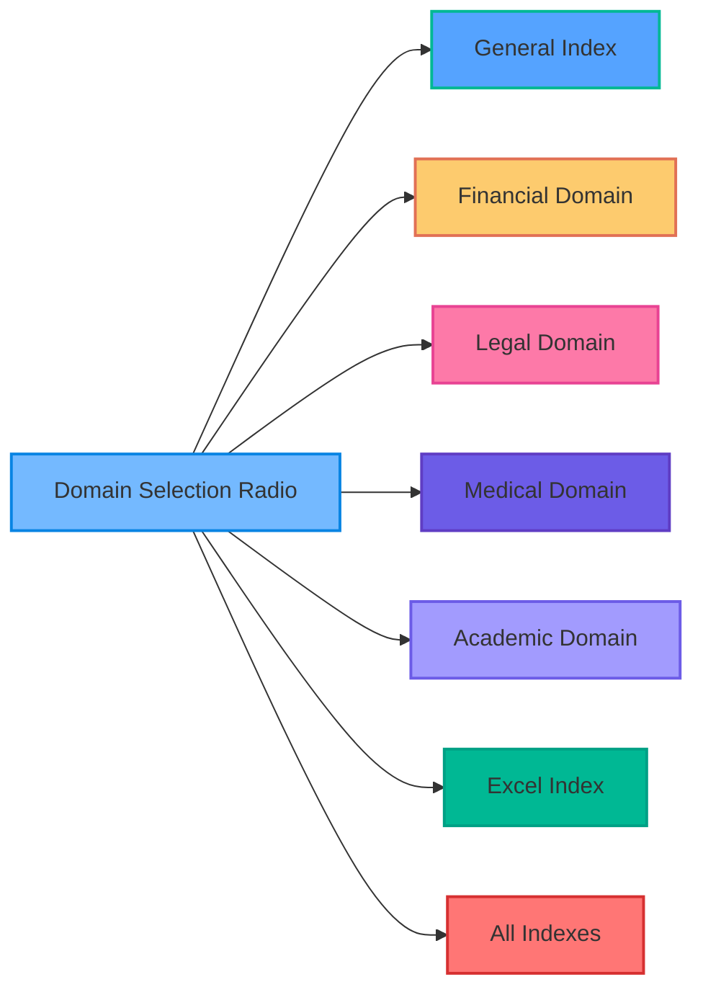
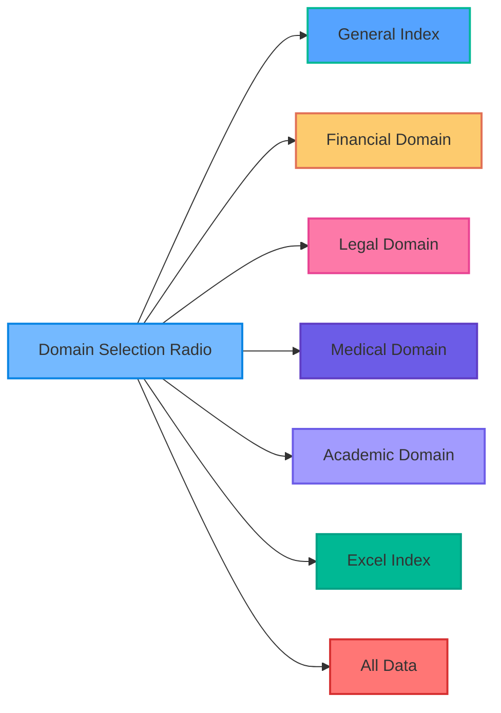
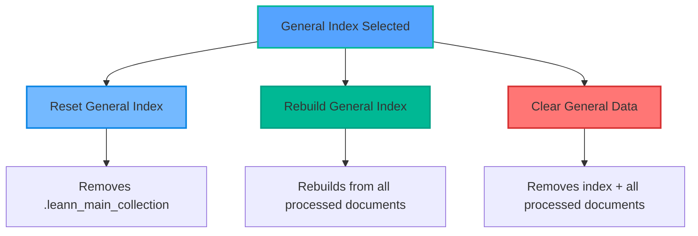
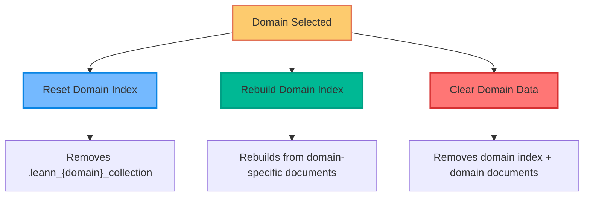
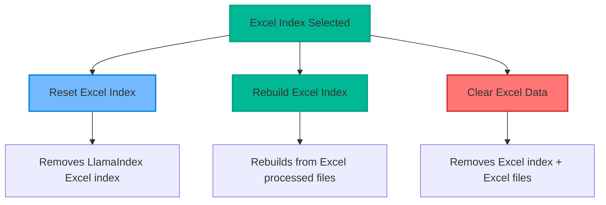
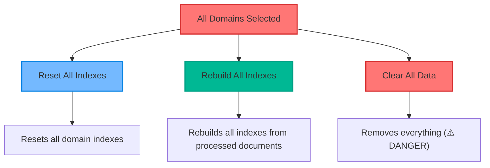

# System Management Interface Analysis - Myr-Ag User Interface

## Overview of System Management

The Gradio user interface now features a **comprehensive System Management tab** with domain-specific controls and unified operations.

## Interface Structure

### 1. Index Management Section

#### Domain Selection Radio

**Available Options:**

- **General Index**: Manages the main LEANN index
- **Financial Domain**: Manages financial-specific index
- **Legal Domain**: Manages legal-specific index
- **Medical Domain**: Manages medical-specific index
- **Academic Domain**: Manages academic-specific index
- **Excel Index**: Manages LlamaIndex Excel database
- **All Indexes**: Manages all indexes simultaneously

#### Operations

- **Reset Selected Index**: Resets the selected domain index (preserves data)
- **Rebuild Selected Index**: Rebuilds the selected domain index from processed documents
- **Dynamic Description**: Shows description based on selected domain

### 2. Data Management Section

#### Domain Selection Radio

#### Operations

- **Clear Selected Domain**: Clears the selected domain data (destructive operation)
- **Confirmation Required**: Checkbox to confirm destructive operations
- **Dynamic Description**: Shows impact description based on selection

## API Endpoints

### Index Management Endpoints

| Endpoint                       | Method | Function                      | Domain Support                      |
| ------------------------------ | ------ | ----------------------------- | ----------------------------------- |
| `/system/reset-index`        | POST   | Reset general LEANN index     | General only                        |
| `/domains/{domain}/reset`    | POST   | Reset specific domain index   | Financial, Legal, Medical, Academic |
| `/system/reset-llamaindex`   | POST   | Reset Excel index             | Excel only                          |
| `/system/rebuild-index`      | POST   | Rebuild general LEANN index   | General only                        |
| `/domains/{domain}/rebuild`  | POST   | Rebuild specific domain index | Financial, Legal, Medical, Academic |
| `/system/rebuild-llamaindex` | POST   | Rebuild Excel index           | Excel only                          |
| `/system/rebuild-all`        | POST   | Rebuild all indexes           | All domains                         |

### Data Management Endpoints

| Endpoint                          | Method | Function                          | Domain Support                      |
| --------------------------------- | ------ | --------------------------------- | ----------------------------------- |
| `/system/clear-general`         | DELETE | Clear general index + documents   | General only                        |
| `/system/clear-domain/{domain}` | DELETE | Clear specific domain + documents | Financial, Legal, Medical, Academic |
| `/system/clear-excel`           | DELETE | Clear Excel index + files         | Excel only                          |
| `/system/clear-all`             | DELETE | Clear everything                  | All domains                         |

## Domain-Specific Operations

### General Index Operations

### Domain-Specific Operations (Financial, Legal, Medical, Academic)

### Excel Index Operations

### All Domains Operations

## Safety Features

### Confirmation System

- **Index Operations**: No confirmation required (non-destructive)
- **Data Operations**: Confirmation checkbox required (destructive)
- **All Data Operation**: Extra warning in description

### Operation Impact Matrix

| Operation       | Index Impact | Data Impact | Uploads Impact | Confirmation |
| --------------- | ------------ | ----------- | -------------- | ------------ |
| Reset General   | Removes      | Preserves   | Preserves      | No           |
| Reset Domain    | Removes      | Preserves   | Preserves      | No           |
| Reset Excel     | Removes      | Preserves   | Preserves      | No           |
| Rebuild General | Rebuilds     | Preserves   | Preserves      | No           |
| Rebuild Domain  | Rebuilds     | Preserves   | Preserves      | No           |
| Rebuild Excel   | Rebuilds     | Preserves   | Preserves      | No           |
| Clear General   | Removes      | Removes     | Preserves      | Yes          |
| Clear Domain    | Removes      | Removes     | Preserves      | Yes          |
| Clear Excel     | Removes      | Removes     | Preserves      | Yes          |
| Clear All       | Removes      | Removes     | Removes        | Yes          |

---

*This analysis reflects the current System Management interface as of the latest update with domain-specific controls and unified operations.*
