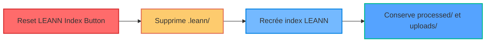
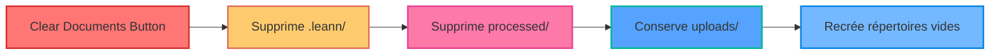

# Cleaning Buttons Analysis - Myr-Ag User Interface

## Overview of Cleaning Buttons

The Gradio user interface has **3 distinct cleaning buttons**, each with a specific function and different consequences.

## Available Buttons

### 1. 🔄 **Reset LEANN Index**

**Function:** Resets only the LEANN vector database

**Impact:**
- ✅ **Removes:** LEANN index (embeddings, metadata)
- ✅ **Preserves:** Processed documents and uploads
- ✅ **Result:** Documents available but not indexed

**API Code:** `DELETE /system/reset-index`
**Implementation:** ✅ Complete and functional

---

### 2. 🗑️ **Clear Documents**

**Function:** Clears processed documents and LEANN index

**Impact:**
- ✅ **Removes:** LEANN index + Processed documents
- ✅ **Preserves:** Upload documents (raw)
- ✅ **Result:** Raw documents available, everything else cleared

**API Code:** `DELETE /system/clear-documents`
**Implementation:** ✅ Complete and functional

---

### 3. 💥 **Clear Everything**

**Function:** Clears EVERYTHING in the system

**Impact:**
- ✅ **Removes:** LEANN index + Processed documents + Upload documents
- ✅ **Preserves:** Nothing
- ✅ **Result:** Completely empty system

**API Code:** `DELETE /system/clear-all`
**Implementation:** ✅ Complete and functional

