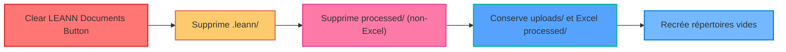

# Cleaning Buttons Analysis - Myr-Ag User Interface

## Overview of Cleaning Buttons

The Gradio user interface has **6 distinct maintenance buttons**, each with a specific function and different consequences.

## Available Buttons

### 1. 🔄 **Reset LEANN Index**

**Function:** Resets only the LEANN vector database

**Impact:**
- ✅ **Removes:** LEANN index (embeddings, metadata)
- ✅ **Preserves:** Processed documents and uploads
- ✅ **Result:** Documents available but not indexed

**API Code:** `DELETE /system/reset-index`
**Implementation:** ✅ Complete and functional

---

### 2. 🔨 **Rebuild LEANN Index**

**Function:** Rebuilds the LEANN index from existing processed documents

**Impact:**
- ✅ **Reads:** Processed documents from data/processed/
- ✅ **Rebuilds:** LEANN index with current documents
- ✅ **Preserves:** All processed documents and uploads
- ✅ **Result:** Fresh index with all available documents

**API Code:** `POST /system/rebuild-index`
**Implementation:** ✅ Complete and functional

---

### 3. 🔄 **Reset LlamaIndex Excel**

**Function:** Resets only the LlamaIndex Excel database

**Impact:**
- ✅ **Removes:** LlamaIndex Excel index (embeddings, metadata)
- ✅ **Preserves:** Processed Excel files and uploads
- ✅ **Result:** Excel files available but not indexed

**API Code:** `DELETE /system/reset-llamaindex`
**Implementation:** ✅ Complete and functional

---

### 4. 🔨 **Rebuild LlamaIndex Excel**

**Function:** Rebuilds the LlamaIndex Excel index from existing processed Excel files

**Impact:**
- ✅ **Reads:** Processed Excel files from data/processed/
- ✅ **Rebuilds:** LlamaIndex Excel index with current files
- ✅ **Preserves:** All processed documents and uploads
- ✅ **Result:** Fresh Excel index with all available files

**API Code:** `POST /system/rebuild-llamaindex`
**Implementation:** ✅ Complete and functional

---

### 5. 🗑️ **Clear LEANN Documents**

**Function:** Clears LEANN index and non-Excel processed documents

**Impact:**
- ✅ **Removes:** LEANN index + Non-Excel processed documents
- ✅ **Preserves:** Upload documents + Excel processed files
- ✅ **Result:** Raw documents + Excel files available, LEANN cleared

**API Code:** `DELETE /system/clear-documents`
**Implementation:** ✅ Complete and functional

---

### 6. 🗑️ **Clear LlamaIndex Excel**

**Function:** Clears LlamaIndex Excel index and Excel processed files

**Impact:**
- ✅ **Removes:** LlamaIndex Excel index + Excel processed files
- ✅ **Preserves:** Upload documents + Non-Excel processed files
- ✅ **Result:** Raw documents + non-Excel files available, Excel cleared

**API Code:** `DELETE /system/clear-llamaindex`
**Implementation:** ✅ Complete and functional

---

### 7. 💥 **Clear Everything**

**Function:** Clears EVERYTHING in the system

**Impact:**
- ✅ **Removes:** LEANN index + LlamaIndex Excel + All processed documents + All upload documents
- ✅ **Preserves:** Nothing
- ✅ **Result:** Completely empty system

**API Code:** `DELETE /system/clear-all`
**Implementation:** ✅ Complete and functional

## Summary

The system provides **7 maintenance buttons** organized by function:

### **Reset Operations** (Index only)
- **Reset LEANN Index** - Clears LEANN index, keeps documents
- **Reset LlamaIndex Excel** - Clears Excel index, keeps files

### **Rebuild Operations** (Recreate from existing)
- **Rebuild LEANN Index** - Rebuilds LEANN from processed documents
- **Rebuild LlamaIndex Excel** - Rebuilds Excel index from processed files

### **Clear Operations** (Remove data)
- **Clear LEANN Documents** - Removes LEANN + non-Excel processed files
- **Clear LlamaIndex Excel** - Removes Excel index + Excel processed files
- **Clear Everything** - Removes everything

Each button requires confirmation via checkbox for safety.

