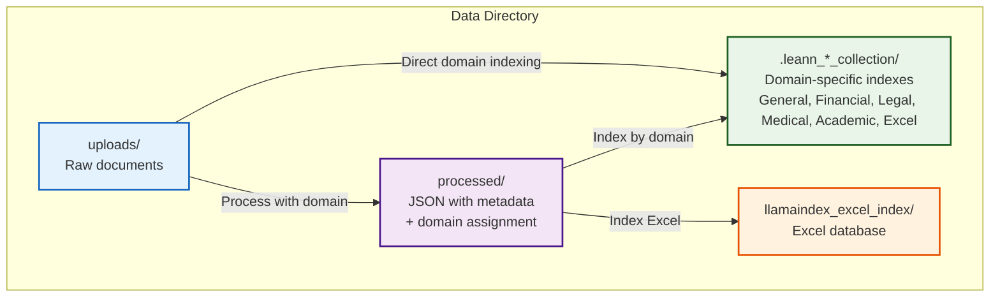
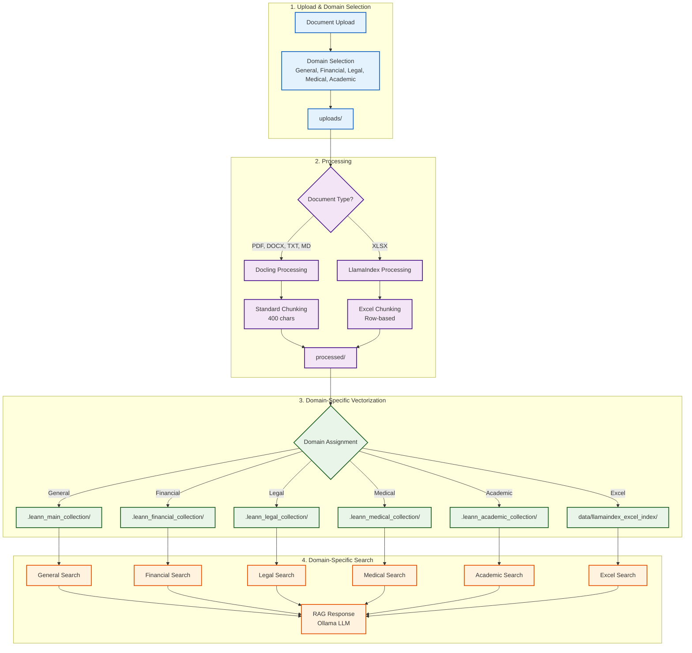

# Data Directory Structure - Myr-Ag

## Overview of Data Architecture



## System Monitoring & Statistics

### Real-Time Statistics

The system now provides comprehensive monitoring and statistics across all domain collections:

- **System Status**: Accurate total documents and chunks across all domains
- **LEANN Vector Store Management**: Detailed information for all 7 collections (main + 6 domains)
- **Domain Statistics**: Real-time updates with correct document and chunk counts
- **Collection Details**: Individual collection status, document count, and chunk count
- **Summary Statistics**: Aggregated totals across all collections

### Collection Structure

```text
System Collections:
├── main_collection (General domain)
├── financial_collection (Financial domain)
├── legal_collection (Legal domain)
├── medical_collection (Medical domain)
├── academic_collection (Academic domain)
└── excel_collection (Excel domain)
```

Each collection maintains its own:

- Vector index files
- Document metadata
- Chunk counts
- Processing status
- Performance metrics

## Detail of Each Directory

### 1. **`data/uploads/`** - Input Documents

```
data/uploads/
└── (futurs documents PDF, DOCX, TXT, MD)
```

**Role:** Temporary storage of raw documents uploaded by the user

**Content:**

- Original untranslated documents
- Supported formats: PDF, DOCX, XLSX, PPTX, TXT, MD, HTML, XHTML, CSV, PNG, JPEG, TIFF, BMP, WEBP, AsciiDoc, XML
- Maximum size: 100MB per file
- **Important:** This directory is cleared during cleanup operations
- **Processing Methods:** Docling (primary), pypdf (fallback), Direct text reading
- **OCR Support:** Automatic text extraction from scanned documents and images
- **Excel Support:** Native processing of XLSX files with table structure preservation (⚠️ EXPERIMENTAL)

**Usage:**

- User uploads documents via the web interface
- Files are temporarily stored here
- The system processes these files then moves them to `processed/`
- **Domain Indexing**: Use "Index Documents by Domain" to process documents with specific domain assignment

---

### 2. **`data/processed/`** - Processed Documents

```
data/processed/
└── (futurs fichiers JSON traités)
```

**Role:** Permanent storage of documents after processing and text extraction

**Content:**

- JSON files with extracted text
- Document metadata (name, size, processing date)
- Text chunks with positions and sizes
- Information about the extraction process
- **Domain assignment** for specialized processing

**Structure of a processed JSON file:**

```json
{
  "file_name": "document.pdf",
  "file_path": "/path/to/original",
  "file_size": 1234567,
  "file_extension": ".pdf",
  "content_length": 2891,
  "chunk_count": 150,
  "domain": "financial",
  "processing_timestamp": "2025-08-30T15:03:17.107",
  "chunks": [
    {
      "text": "Contenu extrait du document...",
      "start": 0,
      "end": 2891,
      "chunk_id": "chunk_1"
    }
  ],
  "extraction_method": "docling_pypdf_fallback",
  "processing_status": "completed"
}
```

#### **Excel-Specific Processing (EXPERIMENTAL)**

Excel files receive enhanced processing with specialized chunking:

**⚠️ Note:** Excel processing with LlamaIndex is experimental and may have limitations.

**Structure of a processed Excel JSON file:**

```json
{
  "file_name": "budget.xlsx",
  "file_path": "/path/to/budget.xlsx",
  "file_size": 17421,
  "file_extension": ".xlsx",
  "content_length": 2697,
  "chunk_count": 51,
  "processing_timestamp": "2025-09-04T16:09:01.082761",
  "excel_processing": true,
  "excel_metadata": [
    {
      "chunk_type": "row",
      "sheet_name": "Feuil1",
      "metadata": {
        "source_file": "/path/to/budget.xlsx",
        "sheet_name": "Feuil1",
        "row_number": 2,
        "column_count": 16,
        "has_data": true
      }
    }
  ],
  "chunks": [
    "[SHEET: Feuil1] [ROW] Row 1: Raison - Amount: Automatique, Date: Date",
    "[SHEET: Feuil1] [ROW] Row 2: Salaire Airbus - Amount: 4093, Date: 28",
    "[SHEET: Feuil1] [ROW] Row 3: Pension - Amount: 1895, Date: 2"
  ],
  "extraction_method": "excel_enhanced_processing",
  "processing_status": "completed"
}
```

**Excel Chunking Features:**

- **Row-based chunks**: Each row becomes a searchable chunk
- **Column-aware processing**: Automatic detection of amounts, names, dates
- **Natural language descriptions**: "Employee: John Doe | Salary: 50000"
- **Multi-sheet support**: Processes all sheets in the workbook
- **Rich metadata**: Sheet names, row numbers, column information

---

### 3. **Vector Databases** - Domain-Specific Indexes

#### 3.1 General LEANN Index

```
.leann_main_collection/
├── main_collection.index             # HNSW index file
├── main_collection.meta.json         # Metadata
├── main_collection.passages.idx      # Passages index
└── main_collection.passages.jsonl    # Passages data
```

#### 3.2 Domain-Specific LEANN Indexes

```
.leann_financial_collection/          # Financial domain index
├── financial_collection.index
├── financial_collection.meta.json
├── financial_collection.passages.idx
└── financial_collection.passages.jsonl

.leann_legal_collection/              # Legal domain index
├── legal_collection.index
├── legal_collection.meta.json
├── legal_collection.passages.idx
└── legal_collection.passages.jsonl

.leann_medical_collection/            # Medical domain index
├── medical_collection.index
├── medical_collection.meta.json
├── medical_collection.passages.idx
└── medical_collection.passages.jsonl

.leann_academic_collection/           # Academic domain index
├── academic_collection.index
├── academic_collection.meta.json
├── academic_collection.passages.idx
└── academic_collection.passages.jsonl
```

#### 3.3 Excel LlamaIndex Database

```
data/llamaindex_excel_index/
├── index.json                        # LlamaIndex configuration
├── docstore.json                     # Document store
├── index_store.json                  # Index store
└── vector_store.json                 # Vector store
```

**Role:** Ultra-efficient storage of vector embeddings and metadata for semantic search

**Content:**

- **`indexes/{index_name}/`** : LEANN index directory containing:
  - HNSW index files for fast retrieval
  - Metadata in JSON format (main_collection.meta.json)
  - Passages index and data files
  - Embedding information
  - Relationships between chunks and documents
  - Searcher configuration files for initialization

---

## Complete Data Flow

### General Documents Flow (PDF, DOCX, TXT, MD, etc.)

```mermaid
flowchart LR
    subgraph Upload["1. Upload"]
        A["PDF/DOCX Document"] --> B["uploads/"]
    end
  
    subgraph Processing["2. Processing"]
        B --> C["Text extraction<br/>Docling"]
        C --> D["Chunking<br/>400 chars<br/>Sentence-based"]
        D --> E["processed/"]
    end
  
    subgraph Vectorization["3. Vectorization"]
        E --> F["Embedding generation<br/>nomic-embed-text-v2-moe"]
        F --> G["LEANN Index<br/>Ultra-efficient storage"]
    end
  
    subgraph Search["4. Search"]
        G --> H["Semantic search<br/>Vector similarity"]
        H --> I["RAG response<br/>Ollama LLM"]
    end
  
    classDef uploadStep fill:#e3f2fd,stroke:#1565c0,stroke-width:2px
    classDef processStep fill:#f3e5f5,stroke:#4a148c,stroke-width:2px
    classDef vectorStep fill:#e8f5e8,stroke:#1b5e20,stroke-width:2px
    classDef searchStep fill:#fff3e0,stroke:#e65100,stroke-width:2px
  
    class A,B uploadStep
    class C,D,E processStep
    class F,G vectorStep
    class H,I searchStep
```



### Excel Documents Flow (XLSX)

```mermaid
flowchart LR
    subgraph Upload["1. Upload"]
        A1["Excel File (.xlsx)"] --> B1["uploads/"]
    end
  
    subgraph Processing["2. Excel Processing"]
        B1 --> C1["Excel parsing<br/>LlamaIndex"]
        C1 --> D1["Row-based chunking<br/>Natural language descriptions"]
        D1 --> E1["processed/"]
    end
  
    subgraph Vectorization["3. Vectorization"]
        E1 --> F1["Embedding generation<br/>LlamaIndex embeddings"]
        F1 --> G1["LlamaIndex Database<br/>data/llamaindex_excel_index/"]
    end
  
    subgraph Search["4. Search"]
        G1 --> H1["Excel-specific search<br/>Row/column queries"]
        H1 --> I1["RAG response<br/>Ollama LLM"]
    end
  
    classDef uploadStep fill:#e3f2fd,stroke:#1565c0,stroke-width:2px
    classDef processStep fill:#f3e5f5,stroke:#4a148c,stroke-width:2px
    classDef vectorStep fill:#e8f5e8,stroke:#1b5e20,stroke-width:2px
    classDef searchStep fill:#fff3e0,stroke:#e65100,stroke-width:2px
  
    class A1,B1 uploadStep
    class C1,D1,E1 processStep
    class F1,G1 vectorStep
    class H1,I1 searchStep
```



### Combined Data Flow with Domain Routing



## Key Points to Understand

### **Separation of Responsibilities:**

- **`uploads/`** : Temporary storage, can be cleared
- **`processed/`** : Permanent storage of extracted data
- **`.leann/`** : LEANN vector database for ultra-efficient search

### **Data Persistence:**

- Processed documents remain in `processed/` even after cleanup
- LEANN index is persistent (HNSW + CSR format)
- Index can be reset without losing processed files

### **Space Management:**

- LEANN provides 97% space savings vs traditional vector databases
- Processed documents are compressed in JSON
- LEANN automatically manages vector optimization and pruning

### **Domain Management:**

- **Domain-Specific Indexes**: Each domain has its own isolated vector index
- **User-Controlled Assignment**: Documents are assigned to domains by user selection
- **Isolated Operations**: Reset, rebuild, or clear individual domains independently
- **Query Routing**: Queries are routed to the appropriate domain index

### **Maintenance Operations:**

- **Reset Index** : Clears only selected domain index
- **Rebuild Index** : Rebuilds selected domain from processed documents
- **Clear Domain** : Clears selected domain index + domain documents
- **Clear All** : Clears all indexes and all data
- **Bulk Operations** : Reset/rebuild all domains at once
- **Reprocess Documents** : Rebuilds index from existing processed documents

---

*This structure ensures clear separation between raw, processed, and vectorized data, enabling efficient management and recovery in case of problems.*
