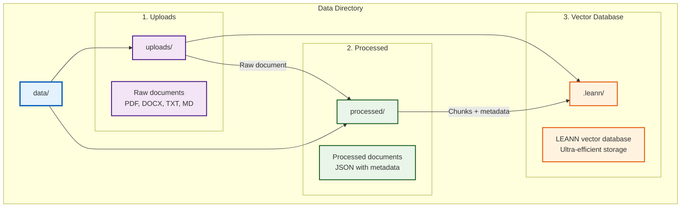

# Data Directory Structure - Myr-Ag

## Overview of Data Architecture



## Detail of Each Directory

### 1. **`data/uploads/`** - Input Documents

```
data/uploads/
├── (vide actuellement)
└── (futurs documents PDF, DOCX, TXT, MD)
```

**Role:** Temporary storage of raw documents uploaded by the user

**Content:**

- Original untranslated documents
- Supported formats: PDF, DOCX, XLSX, PPTX, TXT, MD, HTML, XHTML, CSV, PNG, JPEG, TIFF, BMP, WEBP, AsciiDoc, XML
- Maximum size: 100MB per file
- **Important:** This directory is cleared during cleanup operations
- **Processing Methods:** Docling (primary), pypdf (fallback), Direct text reading
- **OCR Support:** Automatic text extraction from scanned documents and images
- **Excel Support:** Native processing of XLSX files with table structure preservation (⚠️ EXPERIMENTAL)

**Usage:**

- User uploads documents via the web interface
- Files are temporarily stored here
- The system processes these files then moves them to `processed/`

---

### 2. **`data/processed/`** - Processed Documents

```
data/processed/
├── (vide actuellement)
└── (futurs fichiers JSON traités)
```

**Role:** Permanent storage of documents after processing and text extraction

**Content:**

- JSON files with extracted text
- Document metadata (name, size, processing date)
- Text chunks with positions and sizes
- Information about the extraction process

**Structure of a processed JSON file:**

```json
{
  "file_name": "document.pdf",
  "file_path": "/path/to/original",
  "file_size": 1234567,
  "file_extension": ".pdf",
  "content_length": 2891,
  "chunk_count": 150,
  "processing_timestamp": "2025-08-30T15:03:17.107",
  "chunks": [
    {
      "text": "Contenu extrait du document...",
      "start": 0,
      "end": 2891,
      "chunk_id": "chunk_1"
    }
  ],
  "extraction_method": "docling_pypdf_fallback",
  "processing_status": "completed"
}
```

#### **Excel-Specific Processing (EXPERIMENTAL)**

Excel files receive enhanced processing with specialized chunking:

**⚠️ Note:** Excel processing with LlamaIndex is experimental and may have limitations.

**Structure of a processed Excel JSON file:**

```json
{
  "file_name": "budget.xlsx",
  "file_path": "/path/to/budget.xlsx",
  "file_size": 17421,
  "file_extension": ".xlsx",
  "content_length": 2697,
  "chunk_count": 51,
  "processing_timestamp": "2025-09-04T16:09:01.082761",
  "excel_processing": true,
  "excel_metadata": [
    {
      "chunk_type": "row",
      "sheet_name": "Feuil1",
      "metadata": {
        "source_file": "/path/to/budget.xlsx",
        "sheet_name": "Feuil1",
        "row_number": 2,
        "column_count": 16,
        "has_data": true
      }
    }
  ],
  "chunks": [
    "[SHEET: Feuil1] [ROW] Row 1: Raison - Amount: Automatique, Date: Date",
    "[SHEET: Feuil1] [ROW] Row 2: Salaire Airbus - Amount: 4093, Date: 28",
    "[SHEET: Feuil1] [ROW] Row 3: Pension - Amount: 1895, Date: 2"
  ],
  "extraction_method": "excel_enhanced_processing",
  "processing_status": "completed"
}
```

**Excel Chunking Features:**
- **Row-based chunks**: Each row becomes a searchable chunk
- **Column-aware processing**: Automatic detection of amounts, names, dates
- **Natural language descriptions**: "Employee: John Doe | Salary: 50000"
- **Multi-sheet support**: Processes all sheets in the workbook
- **Rich metadata**: Sheet names, row numbers, column information

---

### 3. **`.leann/`** - LEANN Vector Database

```
.leann/
├── indexes/                          # LEANN index directory
│   └── main_collection/              # Main index directory
│       ├── main_collection.index     # HNSW index file
│       ├── main_collection.meta.json # Metadata
│       ├── main_collection.passages.idx # Passages index
│       └── main_collection.passages.jsonl # Passages data
```

**Role:** Ultra-efficient storage of vector embeddings and metadata for semantic search

**Content:**

- **`indexes/{index_name}/`** : LEANN index directory containing:
  - HNSW index files for fast retrieval
  - Metadata in JSON format (main_collection.meta.json)
  - Passages index and data files
  - Embedding information
  - Relationships between chunks and documents
  - Searcher configuration files for initialization


---

## Complete Data Flow

```mermaid
flowchart LR
    subgraph Upload["1. Upload"]
        A["PDF/DOCX Document"] --> B["uploads/"]
    end
    
    subgraph Processing["2. Processing"]
        B --> C["Text extraction<br/>Docling"]
        C --> D["Chunking<br/>400 chars<br/>Sentence-based"]
        D --> E["processed/"]
    end
    
    subgraph Vectorization["3. Vectorization"]
        E --> F["Embedding generation<br/>paraphrase-multilingual-MiniLM-L12-v2"]
        F --> G["LEANN Index<br/>Ultra-efficient storage"]
    end
    
    subgraph Search["4. Search"]
        G --> H["Semantic search<br/>Vector similarity"]
        H --> I["RAG response<br/>Ollama LLM"]
    end
    
    classDef uploadStep fill:#e3f2fd,stroke:#1565c0,stroke-width:2px
    classDef processStep fill:#f3e5f5,stroke:#4a148c,stroke-width:2px
    classDef vectorStep fill:#e8f5e8,stroke:#1b5e20,stroke-width:2px
    classDef searchStep fill:#fff3e0,stroke:#e65100,stroke-width:2px
    
    class A,B uploadStep
    class C,D,E processStep
    class F,G vectorStep
    class H,I searchStep
```



## Key Points to Understand

### **Separation of Responsibilities:**

- **`uploads/`** : Temporary storage, can be cleared
- **`processed/`** : Permanent storage of extracted data
- **`.leann/`** : LEANN vector database for ultra-efficient search

### **Data Persistence:**

- Processed documents remain in `processed/` even after cleanup
- LEANN index is persistent (HNSW + CSR format)
- Index can be reset without losing processed files

### **Space Management:**

- LEANN provides 97% space savings vs traditional vector databases
- Processed documents are compressed in JSON
- LEANN automatically manages vector optimization and pruning

### **Maintenance Operations:**

- **Reset Index** : Clears only `.leann/` index
- **Clear Documents** : Clears `uploads/` and `processed/`
- **Clear All** : Clears all directories
- **Force Searcher Init** : Reinitializes LEANN searcher if initialization fails
- **Reprocess Documents** : Rebuilds index from existing processed documents

---

*This structure ensures clear separation between raw, processed, and vectorized data, enabling efficient management and recovery in case of problems.*
